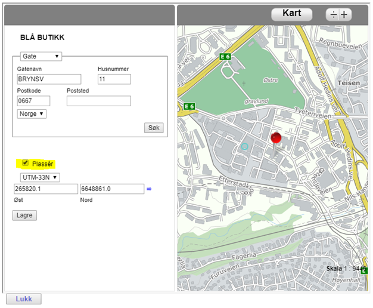



Visma Enterprise - eHandel

**GLN-integrasjon**

Oppdatert 21.6.2019

**Innhold**

[**INNLEDNING](#_lpcbnhiir5f8)	**3****

[GS1 Norway](#_cb5hlbbuag5u)	3

[GLN](#_4qrvulgi1dkr)	3

[Enterprise eHandel](#_5ddaxa6822b4)	3

[Prinsippskisse for integrasjonen](#_i4ozjogua7g9)	4

[Forutsetninger](#_ijlifd2v2gry)	4

[**GRUNNDATA](#_v9gdtoxvogwb)	**5****

[Webservice](#_30tp8pwtmiln)	5

[Systeminformasjon i eHandel](#_c2lzgng2iyda)	5

[Skrive ut GLN-nummer](#_9fi8wih68vvk)	6

[**GLN-INTEGRASJONEN I PRAKSIS](#_ipv13g9whdsq)	**7****

[Søke om nytt GLN](#_1x5ndcuxeatb)	7

[Sende endringsmelding på GLN](#_ko1butff3i7c)	11

[Oppsigelse GLN](#_26gkau657hec)	14

[Administrere alternative leveringsadresser](#_eqpdg7z0i5io)	15

[Rapportlogg](#_o8ptptss2elk)	16
# **
# **INNLEDNING**
## **GS1 Norway**
GS1 - The Global Language of Business!

GS1 Norway er en brukerstyrt, medlemseid, not-for-profit forening. Vi er medlem av en global organisasjon  ̶  GS1 – som utvikler, vedlikeholder og tilbyr globale standarder for effektiv vare- og informasjonsflyt. GS1 er representert i 112 land og over 1 million bedrifter bruker GS1s standarder. GS1 Norway har i dag mer enn 6300 brukere i stadig flere bransjer.

GS1 gjør din vare- og informasjonsflyt enklere, raskere og sikrere

For at aktørene i verdikjeden skal kunne kommunisere med hverandre på en effektiv måte, kreves det at de bruker samme språk. GS1-systemet er et slikt felles språk, som kan forstås på tvers av bransjer og landegrenser.

GS1-systemet er hjertet i vår virksomhet – det effektiviserer aktørenes handel og logistikkprosesser, globalt og lokalt. Basert på erfaringstall og beste praksis fra din bransje i mange land, kan GS1 Norway hjelpe deg med å identifisere hvor potensialet er størst og hvor det er enklest å realisere.

## **GLN**
GLN (Global Location Number) er et lokasjonsnummer som brukes til å entydig identifisere handelspartnere.

Det kan være en juridisk enhet, en rolle i en handelstransaksjon (eks. kjøper, selger, fakturamottaker, eller leveringsmottaker), eller det kan identifisere en fysisk lokasjon (eks. leveringsadresser eller butikkfilialer) 

GLN er består av 13 siffer, og brukes mest i e-handel og transportplanlegging.

Gevinster ved bruk av GLN

Det er flere gevinster ved bruk av GLN. Felles for de fleste gevinstene er at de gjelder både for leverandør og kunde i et handelsforhold. Her er noen av gevinstene:

- GLN tilrettelegger for mer effektiv og standardisert samhandling mellom kunde og leverandør. Dette reduserer transaksjonskostnadene! En tydelig gevinst for alle parter.

- GLN gir en bedre presisjon gjennom hele handelsprosessen. Dette reduserer feil i hele ordreprosessen. Viktig for kunde og leverandør.

- GLN eliminerer feilleveranser – noe som er kostbart både for leverandør og kunde.

- GLN bidrar til en enklere, raskere og sikrere handel!

## **Enterprise eHandel**
eHandel er modulen for elektroniske bestillinger i Visma Enterprise. Du kan få digitalisert hele prosessen fra behov til betaling og få full kontroll på avtalelojaliteten i din organisasjon gjennom å bruke Enterprise eHandel. Ordrer blir sendt ut blant annet som EHF-ordrer og PDF-ordrer på e-post. Felles for alle ordrer er at det er obligatorisk med leveringsadresse, slik at du sikrer at du får varene til riktig sted. eHandel støtter å legge inn GLN som en del av leveringsadressen.
## **Prinsippskisse for integrasjonen**
# 
## **Forutsetninger**
Integrasjon med GS1 for tildeling og vedlikehold av GLN-lokasjonsnummer. Integrasjonen omfatter ny, endring og oppsigelse GLN-nummer. Integrasjon mot GS1 er en lisensbelagt modul, og  krever lisens i uqconfigfilen. Kontakt Vismas prosjektkontor for å få denne på plass. prosjektkontoret@visma.com

# **GRUNNDATA**
## **Webservice**
Kommunikasjonen foregår via en Webservice (WS) som utveksler XML-filer mellom GS1 Norway og Enterprise eHandel. Dette er en del av den ordinære eHandels WS som må eksponeres fra utsiden

Hva må gjøres for at dette skal fungere?

1\.       Kontakt Visma (prosjektkontoret@visma.no) for bestilling av integrasjonen

2\.       Kunde/Visma setter opp integrasjonen, legger inn lisensnøkkel og utfører systemoppsett

3\.       Kontakt GS1 Norway for at de skal klargjøre integrasjonen hos seg. Url til WS + brukernavn/passord til denne må oversendes GS1 Norway. E-post: medlemsservice@gs1.no
## **Systeminformasjon i eHandel**
Åpne: eHandel>Grunndata>Systeminformasjon

Aktiver “XML for kommunikasjon mot GS1 Norway”. For at valgmuligheten skal være aktiv må det ligge nødvendig lisens i uqconfigfilen. 

![ref1] 

Da får du opp denne meldingen. Det betyr at all oppdatering av leveringsadresser fra nå av skal foregå i Visma Enterprise og ikke i GLN-portalen.

 
### **Skrive ut GLN-nummer**

Knappen «Skriv ut» skriver ut leveringsadressene med tilhørende GLN og GLN-status (se eget avsnitt de ulike kodene). Rapporten gir derfor en god oversikt over hvilke adresser som ikke har et gyldig/ok GLN. Det anbefales å skrive ut rapporten til Excel.

![ref2]

# **GLN-INTEGRASJONEN I PRAKSIS**
Det er tre ulike handlinger som gjør at eHandel sender søknader til GS1 Norway som da behandler saken og eventuelt oppdaterer GLN-basen.

- Søke om nytt GLN
- Sende endringsmelding om GLN
- Søke om oppsigelse av GLN

Dette kan gjøres for både forbruksenhetenes hovedadresse og alternative leveringsadresser.
## **Søke om nytt GLN**

Trykk på knappen tildeling GLN:

Du får melding om at forespørsel er sendt til behandling hos GS1 Norway.

Da vil status være “Under tildeling” inntil søknaden er behandlet hos GS1 Norway.

Etter at søknaden er ferdigbehandlet, blir GLN-nummeret lagt inn i eHandel og status satt til OK:

Etter at GLN er tildelt, kan du gå inn i GLN-portalen for å justere GPS-koordinatene som GS1 Norway har registrert. 

1\. Velg endring

2\. Velg aktuell GLN i nedtrekksmeny

3\. Velg Vis i kart.

` `

1\.	Huk av feltet «plasser» og angi korrekt plassering på kartet.

2\.	Lagre.

3\.	Trykk på knappen som heter «send skjema». Da sendes endringsmelding til GS1 Norway.

` `

## **Sende endringsmelding på GLN**

Alle endringer på leveringsadresser skal heretter gjøres kun i eHandel. 

Etter at et GLN er tildelt er feltene på leveringsadressen grået ut. Skal du gjøre en endring, trykker du på knappen “Endre”.

Da åpner feltene seg og du kan endre feltene som skal endres.

Når du trykker “Lagre”, sendes det en endringsmelding til GS1 Norway automatisk.

Statusen endres da til “Under endring”.

Når endringen er utført, endres statusen til “OK” igjen.

## **Oppsigelse GLN**

Når en leveringsadresse skal slettes er det viktig å sende oppsigelse GLN, slik at leveringsadressen fjernes fra GLN-basen også. Trykk på knappen “Oppsigelse GLN” og du får beskjed om at forespørsel om oppsigelse er sendt.

Etter at GS1 Norway har akseptert oppsigelsen, blir en bekreftelse sendt tilbake og det vil stå GLN lokasjonsnummer 0.

![ref3]
## **Administrere alternative leveringsadresser**
Alternative leveringsadresser er et begrep som benyttes i eHandel for å gjøre administrasjonen enklere. Når GS1 Norway mottar informasjon om alternative leveringsadresser, er det ingen forskjell på dette og standard leveringsadresser. Du kommer inn til alternative leveringsadresser ved å trykke “Alt.lev.adr.”.

![ref4]

Knappene i bunnen gjelder GLN-integrasjonen. 

Når du trykker “Ny” får du muligheten til å legge inn en ny leveringsadresse. Etter at den er registrert, markerer du adressen i tabellen og trykker “Tildeling GLN” for å sende en søknad om GLN automatisk.

Marker en eksisterende adresse som allerede har GLN og trykk “Endre” for å endre adressen og send endringsmelding til GS1 Norway automatisk.

Marker en eksisterende adresse og trykk “Oppsigelse GLN” for å slette oppføringen i GLN-basen.
## **Rapportlogg**
For hver gang det sendes eller mottas filer blir rapportloggen oppdatert. Rapportloggen når du fra Systeminformasjon\Elektroniske meldinger.

![ref2]

Rapportloggen\Import av GLN-nr viser hendelser vedrørende GLN-kommunikasjon.

Rapporten finner du også i menyen under Avansert/Dagssluttrutiner/Spørre på rapportlog og der huker av for Import av GLN-nummer.

eHandel - GLN-integrasjon									18

© Visma Enterprise AS

[ref1]: Aspose.Words.6d74dbc2-3aae-487b-b6f0-12c55b8c781e.003.png
[ref2]: Aspose.Words.6d74dbc2-3aae-487b-b6f0-12c55b8c781e.005.png
[ref3]: Aspose.Words.6d74dbc2-3aae-487b-b6f0-12c55b8c781e.022.png
[ref4]: Aspose.Words.6d74dbc2-3aae-487b-b6f0-12c55b8c781e.023.png
